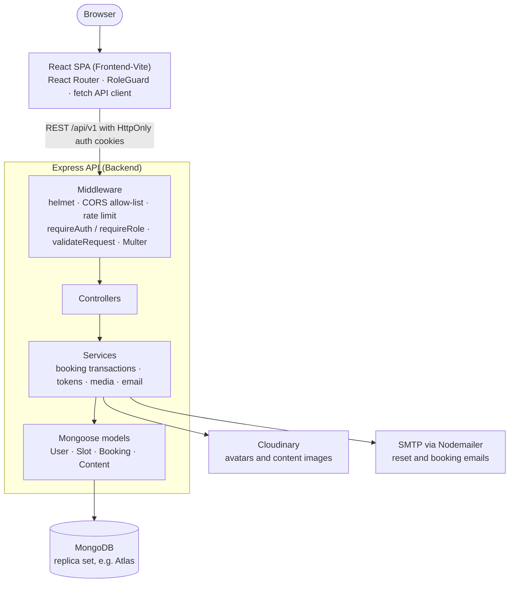
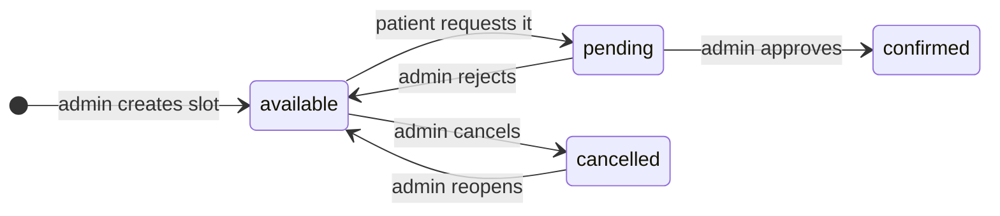

# Rehabilitation Center Booking System

A full-stack web app that lets a rehabilitation center publish session slots and lets patients request them online, with an admin approval workflow and transactional safeguards against double-booking.

**Stack:** React 19 + Vite client · Express 5 + MongoDB REST API · JWT auth in HttpOnly cookies · role-based access control · Cloudinary media · SMTP email

## Highlights

- **No double-booking.** A booking request runs inside a MongoDB transaction. The slot is claimed with a single conditional `findOneAndUpdate` that only matches while the slot is still `available` and in the future (setting it to `pending`), and the booking is inserted in the same transaction. If two patients race for one slot, only one update can match; the other request gets `409 Slot is no longer available`.
- **Transactional review with an audit trail.** Approve/reject also runs in a transaction: only `pending` bookings can be reviewed, and the slot moves from `pending` to `confirmed` or back to `available` through a conditional update that requires it to still be `pending`. Every transition is appended to the booking's `statusHistory` (from, to, actor, note, timestamp), and the outcome email to the patient is dispatched only after the commit. Pending or confirmed slots cannot be edited or deleted, and slots with booking history cannot be deleted.
- **Cookie-based JWT sessions with refresh-token rotation.** Login sets an access token and a refresh token (defaults `1h` / `10d`) as `HttpOnly` cookies with configurable `Secure`, `SameSite` and domain. Each refresh issues a new pair and keeps only the latest refresh token on the user record, so a token that has already been rotated out is rejected; logout revokes it server-side. The React client restores the session on load via `/auth/me`, falling back to a silent refresh.
- **Role-based access control.** `requireAuth` verifies the JWT (cookie or `Authorization: Bearer`) and reloads the user from MongoDB on every authenticated request, rejecting inactive accounts. `requireRole("admin")` guards the whole `/api/v1/admin` router, and a client-side `RoleGuard` sends admins to `/admin` and patients to `/user`.
- **Request validation and hardening.** Hand-written validators run through a `validateRequest({ body, params, query })` middleware and return field-level `400` errors (email format, password strength, ObjectIds, `HH:mm` times, enums, pagination bounds). The public auth endpoints share a rate limiter (20 requests per 15 minutes per IP), `helmet` sets security headers, CORS uses an origin allow-list, and a central error handler maps duplicate keys to `409`, Mongoose validation/cast errors to `400` and JWT errors to `401`.
- **Hashed reset tokens and Cloudinary media.** Password-reset tokens are 32 random bytes; only their SHA-256 hash is stored, with a 15-minute expiry. Uploaded images are kept in memory by Multer (images only, 5 MB each) and streamed to Cloudinary.

## Features

### Patients (`user` role)

- Sign up with email and password (at least 8 characters, with upper- and lower-case letters, a number and a symbol) and sign in.
- Browse upcoming available slots and request one, with optional notes for the admin team.
- Track requests by status (pending, approved, rejected), including the admin's review note.
- Read published center information (content blocks with images and contact details) and update their name and profile photo.

### Admins (`admin` role)

- Create, edit, cancel and delete session slots. Times use `HH:mm`, the end must be after the start, duplicate date/time slots are rejected, and pending or confirmed slots are locked.
- Review booking requests in pending, approved and rejected tabs, and approve or reject each one with a note. The patient is emailed the outcome when SMTP is configured.
- Manage center content blocks (hero, section, facility, gallery, contact, generic) with multi-image upload, append-or-replace image updates, contact details and a publish/draft toggle.

### In the API, not yet in the web client

- Google sign-in: `POST /auth/google` verifies a Google ID token with `google-auth-library` (the UI button is disabled).
- Forgot/reset password via an emailed link, and change password.
- Email verification endpoint; signup currently creates accounts as already verified.

## Architecture



Routers attach per-route middleware, controllers handle HTTP, services hold the business logic, and Mongoose models define the schema. Successful responses share one envelope (`{ statusCode, data, message, success }`), and a central error handler normalizes failures into `{ success: false, message, errors: [{ field, message }] }`.

## Tech stack

| Layer | Tools |
| --- | --- |
| Frontend | React 19, Vite 8, React Router 7, Tailwind CSS 4, shadcn/ui components on Radix UI, lucide-react |
| Backend | Node.js, Express 5, MongoDB with Mongoose 9 |
| Auth and security | jsonwebtoken, bcrypt, cookie-parser (HttpOnly cookies), helmet, cors, express-rate-limit, google-auth-library |
| Files and email | Multer (in-memory uploads), Cloudinary, Nodemailer (SMTP) |
| Tooling | nodemon, ESLint |

## API overview

All paths are relative to `/api/v1`. List endpoints accept `page` and `limit` (max 100) and return `{ items, pagination }`. Request and response examples for every endpoint are in [Backend/README.md](Backend/README.md).

Access levels: **Public** needs no auth; **Rate-limited** is public and shares the auth limiter; **Signed in** is any authenticated account; **Admin** requires the `admin` role.

| Method | Path | Access | Purpose |
| --- | --- | --- | --- |
| GET | `/status` | Public | Health check |
| **Auth** | | | |
| POST | `/auth/signup` | Rate-limited | Create an email/password account |
| POST | `/auth/login` | Rate-limited | Sign in and set the access/refresh cookies |
| POST | `/auth/google` | Rate-limited | Sign in with a Google ID token |
| POST | `/auth/verify-email` | Rate-limited | Confirm an email-verification token |
| POST | `/auth/forgot-password` | Rate-limited | Email a password-reset link |
| POST | `/auth/reset-password/:token` | Rate-limited | Set a new password with a reset token |
| POST | `/auth/refresh-token` | Refresh cookie | Rotate the token pair |
| POST | `/auth/logout` | Signed in | Revoke the refresh token and clear cookies |
| POST | `/auth/change-password` | Signed in | Change password (current password required) |
| GET | `/auth/me` | Signed in | Current user's profile |
| PATCH | `/auth/profile` | Signed in | Update name and/or avatar (multipart) |
| **Slots** | | | |
| GET | `/slots/available` | Public | Upcoming available slots (`dateFrom`, `dateTo`) |
| **Bookings** | | | |
| POST | `/bookings/request` | Signed in | Request a slot (`slotId`, optional `notes`) |
| GET | `/bookings/my` | Signed in | Own bookings (`status` filter) |
| **Content** | | | |
| GET | `/content` | Public | Published content blocks (`type` filter) |
| GET | `/content/:key` | Public | One published block by key |
| **Admin** | | | |
| GET | `/admin/slots` | Admin | All slots (`status`, `dateFrom`, `dateTo`) |
| POST | `/admin/slots` | Admin | Create a slot as `available` or `cancelled` |
| PUT | `/admin/slots/:id` | Admin | Edit an available or cancelled slot |
| DELETE | `/admin/slots/:id` | Admin | Delete a slot that has no booking history |
| GET | `/admin/bookings` | Admin | All bookings (`status` filter) |
| PUT | `/admin/bookings/:id` | Admin | Approve or reject a pending booking (`action`, `notes`) |
| GET | `/admin/content` | Admin | All content blocks, including drafts (`type`, `isPublished`) |
| POST | `/admin/content` | Admin | Create a block with up to 10 images (multipart) |
| PUT | `/admin/content/:id` | Admin | Update a block; append or replace images |
| DELETE | `/admin/content/:id` | Admin | Delete a block |

## Data model

| Collection | Key fields | Relations and indexes |
| --- | --- | --- |
| `users` | `name`, `email` (unique), `password` (bcrypt hash, excluded from queries by default), `googleId`, `avatar`, `role` (`user` / `admin`), `isActive`, `refreshToken`, hashed reset/verification tokens with expiry | unique `email` |
| `slots` | `date`, `startTime` / `endTime` (`HH:mm`), `startsAt` / `endsAt` (computed in a `pre("validate")` hook), `status` (`available` / `pending` / `confirmed` / `cancelled`) | `createdBy` → users; unique (`date`, `startTime`, `endTime`); (`status`, `startsAt`) |
| `bookings` | `status` (`pending` / `approved` / `rejected`), `notes`, `reviewedAt`, `statusHistory[]` (`from`, `to`, `actor`, `note`, `changedAt`) | `user` → users, `slot` → slots, `reviewedBy` → users; (`user`, `status`, `createdAt`), (`slot`, `createdAt`) |
| `contents` | `key` (unique), `type` (`hero` / `section` / `facility` / `gallery` / `contact` / `generic`), `title`, `body`, `images[]` (Cloudinary URL, public ID, dimensions, format), `contactInfo`, `isPublished` | (`type`, `isPublished`, `updatedAt`) |

Slot lifecycle (bookings move from `pending` to `approved` or `rejected` alongside it):



## Getting started

### Prerequisites

- Node.js 20.19+ or 22.12+ (required by Vite 8 and Mongoose 9) and npm.
- A MongoDB deployment that supports transactions, i.e. a replica set such as a MongoDB Atlas cluster. Booking and review use multi-document transactions, which a standalone `mongod` rejects.
- Optional: a Cloudinary account (image uploads), SMTP credentials (emails) and a Google OAuth client ID (Google sign-in endpoint).

### 1. Backend

```bash
git clone https://github.com/Aditya-XR/Rehabilitation.git
cd Rehabilitation/Backend
npm install
cp .env.example .env   # then fill in the values
npm run dev            # nodemon; `npm start` runs plain node
```

Configure `.env` from [`Backend/.env.example`](Backend/.env.example):

- `MONGODB_URI`, `ACCESS_TOKEN_SECRET` and `REFRESH_TOKEN_SECRET` are required; the server will not start without them.
- Set `CORS_ORIGIN` to the web client's origin. The Vite dev server runs on `http://localhost:5173`, while the example file uses `http://localhost:3000`. A comma-separated list is accepted.
- `FRONTEND_URL` is the base URL used in password-reset email links; set it to the same origin.
- Cloudinary (`CLOUDINARY_*`), SMTP (`SMTP_*`, `MAIL_FROM`) and `GOOGLE_CLIENT_ID` are optional. Without SMTP, emails are skipped with a warning in the log; without Cloudinary, image uploads return an error.

The API listens on `http://localhost:5000` (`PORT`), and `GET /api/v1/status` is a health check.

### 2. Web client

```bash
cd ../Frontend-Vite
npm install
npm run dev            # http://localhost:5173
```

The client calls `http://localhost:5000/api/v1` by default. To use another API URL, set `VITE_API_BASE_URL` in `Frontend-Vite/.env.local` (read in [`src/lib/api/config.js`](Frontend-Vite/src/lib/api/config.js)). `npm run build` produces a production bundle in `dist/`. The older Next.js client in `Frontend/` reads `NEXT_PUBLIC_API_BASE_URL` instead (see [`Frontend/.env.example`](Frontend/.env.example)).

### 3. Create an admin

There is no admin sign-up endpoint. Register through the web client, set that user's `role` to `admin` in the `users` collection (database `rehabilitation_db` by default, see `DB_NAME`), then sign in again:

```js
// mongosh
db.users.updateOne({ email: "you@example.com" }, { $set: { role: "admin" } })
```

After sign-in, admins are routed to `/admin` and patients to `/user`.

## Project structure

```text
Rehabilitation/
├── Backend/                Express API
│   ├── .env.example
│   ├── README.md           endpoint reference with request/response examples
│   └── src/
│       ├── server.js       connects to MongoDB, then starts the HTTP server
│       ├── app.js          global middleware; mounts routes at /api/v1
│       ├── config/         env parsing, Cloudinary and SMTP clients
│       ├── database/       MongoDB connection
│       ├── routes/         auth, slots, bookings, content, admin
│       ├── middleware/     auth/role, rate limit, validation, uploads, errors
│       ├── validations/    request validators per resource
│       ├── controllers/    HTTP handlers
│       ├── services/       business logic: booking transactions, tokens, media, email
│       ├── models/         User, Slot, Booking, Content
│       └── utils/          ApiError/ApiResponse, pagination, cookies, date helpers
├── Frontend-Vite/          React + Vite web client
│   └── src/
│       ├── pages/          HomePage (sign-in), AdminPage, UserPage
│       ├── components/     auth page, RoleGuard, dashboard views, shadcn/ui
│       └── lib/            fetch API client, auth context, helpers
└── Frontend/               earlier Next.js + TypeScript version of the same client
```
